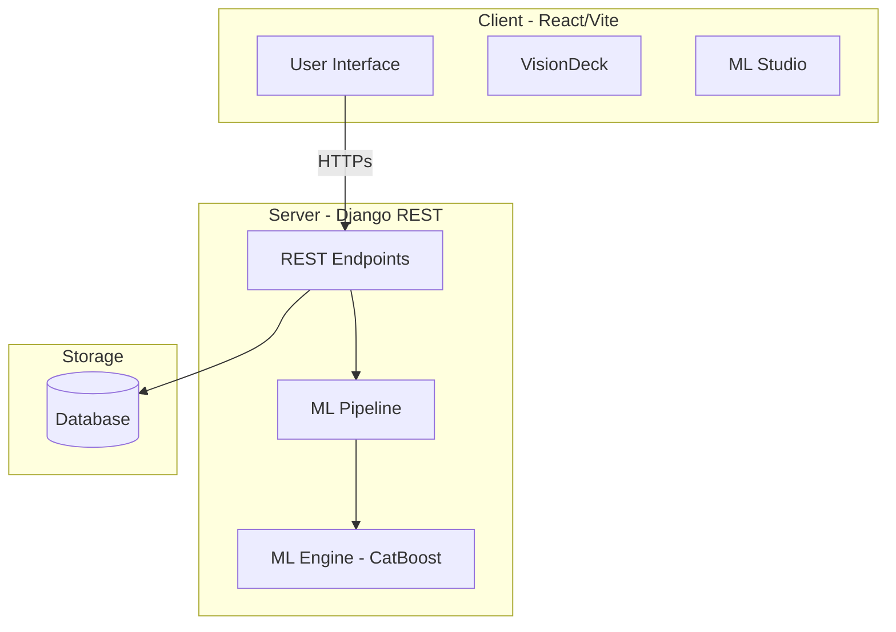

<div align="center">

# 📈 Social Pulse
### *Social Media Engagement Intelligence*

[](https://git.io/typing-svg)

---


[🚀 Live Demo](https://socialpuls.vercel.app) • [📡 API Documentation](https://social-pulse-n4r7.onrender.com) • [👨‍💻 Creator Portfolio](https://abanee.vercel.app)

</div>

---

## � Introduction

**Social Pulse** is a cutting-edge full-stack intelligence platform meticulously crafted for teams to measure, decipher, and forecast social media engagement. By orchestrating a robust **Django** backend with a lightning-fast **Vite + React** frontend, we empower marketers and content creators to transition from guesswork to data-driven precision.

### Why Social Pulse?
- **Predictive Analytics:** Leverage CatBoost-powered models for high-fidelity engagement forecasting.
- **Deep Insights:** Uncover hidden patterns with interactive Exploratory Data Analysis (EDA).
- **Production Ready:** Scalable architecture with a documented REST API.

---

## 🛠 Tech Stack

<div align="center">

| **Frontend** | **Backend** | **Data Science** |
| :---: | :---: | :---: |
|  |  |  |
|  |  |  |
|  |  |  |

</div>

---

## 🎯 Features & Capabilities

<details open>
<summary><b>🔍 Engagement Prediction</b></summary>
<br>
Utilizes the integrated ML Studio to train and predict social metrics using Regression and Classification models. Get instant insights into reach, likes, and shareability.
</details>

<details>
<summary><b>📊 Interactive Visualization</b></summary>
<br>
The VisionDeck dashboard provides real-time visualizations including:
- 🥧 Interactive Pie Charts for platform distribution.
- 📉 Trend Analysis with Line Graphs.
- 📊 Comparative Bar Charts for performance metrics.
</details>

<details>
<summary><b>🛠 Refinery & ML Studio</b></summary>
<br>
- **DatasetStudio:** Seamlessly manage and explore your raw data.
- **Refinery:** Advanced cleaning and preprocessing pipelines.
- **ML Studio:** A playground for building, training, and evaluating ML models.
</details>

---

## 🏗 System Architecture



---

## 🚀 Getting Started

### Prerequisites
- Python 3.10+
- Node.js 18+
- npm or yarn

### 1. Installation

```bash
# Clone the repository
git clone https://github.com/abaneesh/Social-Pulse.git
cd Social-Pulse
```

### 2. Backend Setup
```bash
cd backend
python -m venv venv
# Windows: venv\Scripts\activate | Unix: source venv/bin/activate
pip install -r requirements.txt
python manage.py migrate
python manage.py runserver
```

### 3. Frontend Setup
```bash
cd social-pulse
npm install
npm run dev
```

---

## � Roadmap & Future Work
- [ ] **Real-time API Integration:** Direct hooks for Meta & Twitter APIs.
- [ ] **Multi-tenant Support:** Collaboration tools for marketing teams.
- [ ] **Advanced NLP:** Sentiment analysis for comment sections.
- [ ] **Mobile App:** React Native extension for on-the-go monitoring.

---

## 🤝 Contributing & Support

Contributions make the open-source community an amazing place! Any contributions you make are **greatly appreciated**.

1. Fork the Project
2. Create your Feature Branch (`git checkout -b feature/AmazingFeature`)
3. Commit your Changes (`git commit -m 'Add some AmazingFeature'`)
4. Push to the Branch (`git push origin feature/AmazingFeature`)
5. Open a Pull Request

---

<div align="center">

Developed with ❤️ by [Abaneesh M](https://www.linkedin.com/in/abaneesh-m)

[](https://www.linkedin.com/in/abaneesh-m)
[](https://twitter.com/abaneesh)

</div>

```
